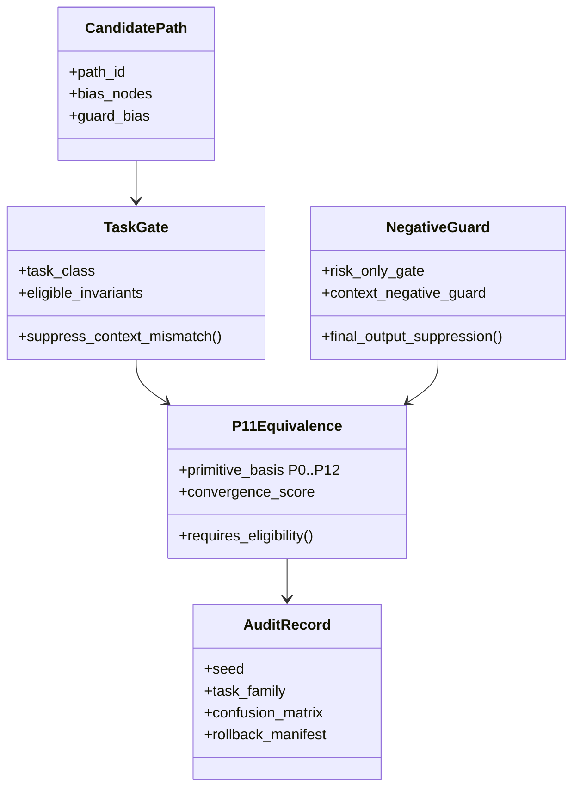

# NUMARA P11 V0.4 Forward Packet

## Rehydrated State

V0.2 found the failure: P11-style convergence was too eager and produced false convergence under risk-only tasks. V0.3 repaired that failure inside the local stochastic harness by adding task gates, invariant eligibility, context-negative suppression, and stronger final-output suppression. V0.3.2 then turned the one-off harness into an implementation scaffold with validation, runner, configs, tests, and smoke output.

Canonical rule:

```text
P11 convergence requires eligibility.
Equivalence without context gating becomes false convergence.
```

## Visual Architecture


## UML-Like Model



## Related Work Positioning


The strongest comparison point is not only model routing. RouteLLM routes between stronger and weaker LLMs to manage cost and quality. LLM-Blender ranks and fuses candidate model outputs. Mixture-of-Agents layers agents so later layers can use earlier outputs. ReAct interleaves reasoning with action. MCP standardizes tool and data access. LangGraph and the OpenAI Agents SDK focus on workflow orchestration with handoffs, state, tools, guardrails, and tracing. DSPy compiles LM pipelines against metrics. MemGPT manages context/memory over longer horizons.

Numara/P11 is closest to these systems where they route, rank, fuse, or orchestrate. Its proposed distinction is narrower and testable: convergence is treated as a gated event. A candidate equivalence is not accepted merely because paths look similar; it must pass task eligibility and negative-control suppression.

## V0.4 Experimental Ladder

| Stage | Purpose | Scale | Gate |
|---|---:|---:|---|
| Smoke | catch implementation errors | 3 seeds / 3 families / ~3k runs | no structural failures |
| Pilot | estimate stability | 10 seeds / 10 families / ~100k runs | false convergence <= 5% |
| Scale | stress generalization | 10 seeds / 10 families / 10 negatives / ~1M runs | confusion matrix + seed variance |

## Draft Paper V0.2 Revision Targets

1. Put related work before the architecture claim so reviewers see the field first.
2. Make the canonical rule the center of the contribution.
3. Add the architecture figure and related-work landscape.
4. Add the comparison matrix as a formal table.
5. Replace broad uniqueness claims with a testable uniqueness claim.
6. Describe V0.4 as a falsification attempt, not a victory lap.

## Sources

- [Retrieval-Augmented Generation](https://arxiv.org/abs/2005.11401): RAG combines parametric generation with non-parametric retrieval for knowledge-intensive tasks.
- [ReAct](https://arxiv.org/abs/2210.03629): ReAct interleaves reasoning traces and actions so agents can gather information and update plans.
- [RouteLLM](https://arxiv.org/abs/2406.18665): RouteLLM learns routers that trade off quality and cost when selecting between LLMs.
- [Model Context Protocol](https://modelcontextprotocol.io/specification/2025-03-26): MCP standardizes integration between LLM applications, tools, and data sources.
- [MemGPT](https://arxiv.org/abs/2310.08560): MemGPT proposes virtual context management across memory tiers for long-running LLM applications.
- [LLM-Blender](https://aclanthology.org/2023.acl-long.792/): LLM-Blender ranks candidate outputs and fuses strong candidates into a final answer.
- [Mixture-of-Agents](https://arxiv.org/abs/2406.04692): MoA uses layered agent outputs as auxiliary information for later agent layers.
- [LangGraph](https://docs.langchain.com/oss/python/langgraph/overview): LangGraph is a low-level orchestration framework for long-running, stateful agents.
- [OpenAI Agents SDK](https://github.com/openai/openai-agents-python): The Agents SDK exposes agents, tools, handoffs, guardrails, human-in-the-loop, sessions, and tracing.
- [DSPy](https://arxiv.org/abs/2310.03714): DSPy treats LM programs as optimizable pipelines and compiles them against metrics.
